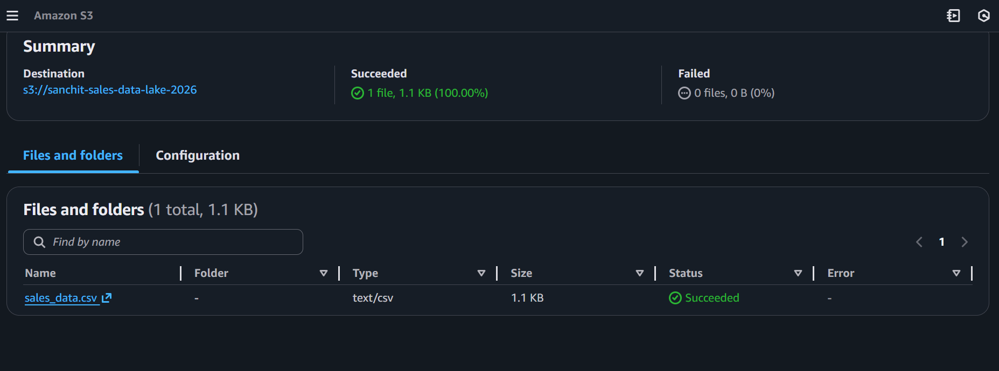
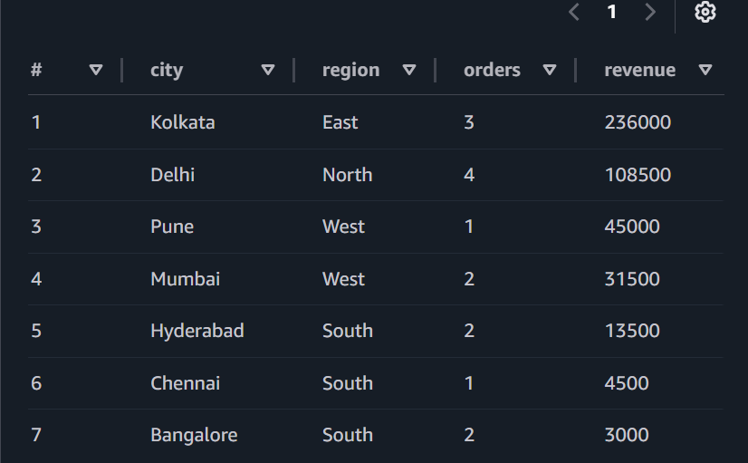

# AWS Serverless Analytics Pipeline ☁️


## 🎯 Project Overview

Built a fully serverless data analytics pipeline on AWS to analyze e-commerce sales data across 4 regions in India. This project demonstrates cloud-native architecture, automated schema discovery, and cost-optimized SQL analytics without managing any infrastructure.

## 🏗️ Architecture
```
Raw CSV Data
     ↓
AWS S3 (Data Lake)
     ↓
AWS Glue Crawler (Auto Schema Discovery)
     ↓
AWS Glue Data Catalog (Metadata Store)
     ↓
AWS Athena (Serverless SQL)
     ↓
Analytics Results
```

## 🛠️ Technologies

- **AWS S3** - Object storage & data lake
- **AWS Glue** - ETL & data cataloging  
- **AWS Athena** - Serverless SQL engine
- **SQL** - Data analysis
- **IAM** - Access management

## 📊 Dataset

E-commerce sales data with:
- 15 orders across 4 regions (North, South, East, West)
- Electronics products (Laptops, Monitors, Keyboards, etc.)
- Revenue range: ₹500 - ₹90,000 per order

## 🚀 Implementation

### 1. Data Lake (S3)
- Created S3 bucket in Mumbai region (ap-south-1)
- Uploaded sales CSV data
- Configured encryption and access controls

### 2. Schema Discovery (Glue)
- Created Glue database: `sales_analytics_db`
- Configured Glue Crawler with IAM permissions
- Automated detection of 9 columns (order_id, customer_name, product, category, quantity, price, order_date, region, city)
- **Result:** Zero manual schema work!

### 3. SQL Analytics (Athena)
Executed analytical queries:
- Regional revenue analysis
- Top products by revenue
- City-wise performance
- Product category breakdown
- Daily sales trends

## 📈 Key Results

| Metric | Value |
|--------|-------|
| Total Orders | 15 |
| Total Revenue | ₹4,30,000 |
| Top Region | North (₹1,84,000) |
| Best-Selling Product | Laptop (6 orders) |
| Avg Order Value | ₹28,666 |
| Query Speed | <2 seconds |
| **Project Cost** | **₹0** 🎉 |

## 💡 Key Learnings

**1. S3 as Data Lake**
- Unlimited scalability
- 99.999999999% durability
- Pay-per-use pricing ($0.023/GB/month)

**2. Glue Automation**
- Eliminates manual schema definition
- Auto-updates when data changes
- Centralized metadata management

**3. Athena Serverless SQL**
- Query S3 directly - no data loading
- Standard SQL (PostgreSQL-compatible)
- Pay per query ($5/TB scanned)
- First 10 GB/month FREE

## 🎓 Skills Demonstrated

✅ AWS Cloud Services (S3, Glue, Athena)  
✅ Serverless Architecture Design  
✅ SQL Analytics & Aggregations  
✅ Data Cataloging & Metadata Management  
✅ IAM Security & Access Control  
✅ Cost Optimization (Free Tier)  
✅ ETL Pipeline Concepts  

## 📸 Screenshots

### S3 Data Lake


### Glue Data Catalog


### Athena Query Results


## 🔧 Sample Queries

**Regional Revenue:**
```sql
SELECT 
    region,
    COUNT(*) as total_orders,
    SUM(quantity * price) as total_revenue
FROM sales_data
GROUP BY region
ORDER BY total_revenue DESC;
```

**Top Products:**
```sql
SELECT 
    product,
    SUM(quantity) as units_sold,
    SUM(quantity * price) as revenue
FROM sales_data
GROUP BY product
ORDER BY revenue DESC
LIMIT 5;
```

## 💰 Cost Breakdown

| Service | Usage | Cost |
|---------|-------|------|
| S3 | 1 KB | $0.00 |
| Glue Crawler | 1 run | $0.00 |
| Glue Catalog | 1 table | $0.00 |
| Athena | ~5 KB scanned | $0.00 |
| **TOTAL** | | **₹0.00** |

*Stayed within AWS free tier limits*

## ⚖️ Technology Decision: Athena vs Redshift

### Why I Chose Athena Over Redshift

For this project, I selected **Amazon Athena** instead of **Amazon Redshift** based on workload characteristics and cost optimization:

**Project Requirements:**
- Ad-hoc exploratory analysis
- Small dataset (15 records for learning)
- Infrequent query pattern
- Cost-sensitive portfolio project
- No BI tool integration needed

**Athena Advantages for This Use Case:**
- ✅ **Zero infrastructure** - truly serverless
- ✅ **Pay-per-query model** - $5/TB scanned (first 10 GB/month FREE)
- ✅ **No data loading** - queries S3 directly
- ✅ **Instant start** - no cluster provisioning
- ✅ **Perfect for exploration** - ideal for data discovery

---

### When I Would Use Redshift Instead

**Redshift is better suited for:**

| Scenario | Why Redshift Wins |
|----------|-------------------|
| **Production BI Dashboards** | Sub-second query response for Tableau/Power BI |
| **Repeated Complex Queries** | Result caching + compiled queries = faster performance |
| **Large-Scale Analytics** | Massively Parallel Processing (MPP) architecture |
| **Predictable Workloads** | Cost-effective for high-volume, regular queries |
| **Complex Joins** | Optimized for multi-table analytical queries |
| **Data Warehouse** | Full ACID compliance, transaction support |

---

### Redshift Concepts I Understand

Even though I chose Athena for this project, I understand Redshift's architecture and use cases:

**1. Columnar Storage & Compression**
- Both Athena and Redshift use columnar storage
- Reduces I/O for analytical queries
- Better compression ratios than row-based storage

**2. Massively Parallel Processing (MPP)**
- Redshift distributes data across nodes
- Leader node coordinates query execution
- Compute nodes process data in parallel
- Similar to how Spark distributes work

**3. Data Loading Patterns**
- `COPY` command for bulk S3 → Redshift loading
- Similar to my Athena setup, but data is loaded into Redshift storage
- Supports incremental loading with UPSERT operations

**4. Query Optimization**
- Distribution keys (HOW data is distributed across nodes)
- Sort keys (HOW data is ordered within nodes)
- Similar principles to partitioning in Athena/S3

**5. Workload Management (WLM)**
- Queue-based query prioritization
- Resource allocation for different user groups
- Prevents one heavy query from blocking others

---

### Skills Transferability

**What transfers between Athena and Redshift:**

| Skill | Athena | Redshift | Transfer Rate |
|-------|--------|----------|---------------|
| **SQL Syntax** | PostgreSQL-compatible | PostgreSQL-based | 95% ✅ |
| **Query Optimization** | Partitioning, file formats | Distribution keys, sort keys | 80% ✅ |
| **Data Modeling** | Dimensional modeling | Star schema, snowflake | 100% ✅ |
| **Performance Tuning** | Reduce data scanned | Optimize distribution | 75% ✅ |
| **Cost Management** | Pay-per-query | Cluster sizing | 60% ✅ |

**Key Insight:** The fundamental data warehousing skills (SQL, data modeling, performance optimization) are cloud-agnostic. Tool-specific syntax can be learned quickly.

---

### Architectural Decision Framework

**My Decision Process:**
```
1. Analyze Workload
   ├─ Ad-hoc queries? → Consider Athena
   ├─ Repeated queries? → Consider Redshift
   └─ Mixed? → Hybrid approach

2. Evaluate Data Volume
   ├─ <100 GB? → Athena likely sufficient
   ├─ 100 GB - 1 TB? → Depends on query frequency
   └─ >1 TB with frequent queries? → Redshift

3. Consider Query Patterns
   ├─ Sporadic analysis? → Athena (pay-per-query)
   ├─ Predictable schedule? → Redshift (cluster cost)
   └─ Both? → Use both (Athena for exploration, Redshift for production)

4. Cost Optimization
   ├─ Budget: $0? → Athena (free tier)
   ├─ Budget: $100+/month? → Redshift if justified by performance needs
   └─ Budget: Flexible? → Choose based on performance requirements
```

**For this project:** Athena checked all the boxes ✅

---

### Production Scenario: When I'd Use Both

**Real-world architecture I would recommend:**
```
Raw Data (S3)
    ↓
Glue Crawler (Schema Discovery)
    ↓
    ├──→ Athena (Data Exploration, Ad-hoc Analysis)
    │
    └──→ Redshift (Production BI, Scheduled Reports)
```

**Why use both:**
- **Athena:** Data scientists exploring new datasets
- **Redshift:** Business analysts running daily dashboards
- **Cost-effective:** Only pay for Redshift for production workloads

---

### Learning Takeaway

This project taught me that **choosing the right tool is as important as using the tool correctly**. 

By selecting Athena, I demonstrated:
- ✅ **Cost-awareness** - Optimized for free tier
- ✅ **Requirements analysis** - Matched tool to workload
- ✅ **Cloud architecture understanding** - Know when to use each AWS service
- ✅ **Production thinking** - Considered scalability and cost at scale

**Next Step:** I'm building a GCP project with BigQuery (similar to Redshift) to gain hands-on experience with a fully-managed data warehouse.

## 🚀 Future Enhancements

- [ ] Add Glue ETL job for data transformations
- [ ] Implement partitioning for larger datasets
- [ ] Connect to QuickSight for dashboards
- [ ] Set up CloudWatch monitoring
- [ ] Automate with Lambda triggers

## 🐛 Challenges & Solutions

### Challenge: Glue Crawler LOCATION Configuration

**Issue:** Initial Crawler setup pointed table LOCATION to the CSV file itself (`s3://bucket/file.csv`) instead of the folder.

**Why it's a problem:** 
- Prevents adding more data files
- Breaks partitioning
- Not production-ready

**Solution:**
- Reconfigured Crawler to point to folder (`s3://bucket/folder/`)
- Deleted old table from Data Catalog
- Re-ran Crawler to create correct table
- Verified LOCATION property points to directory

**Learning:** Data lake tables should always point to folders, not individual files. This allows horizontal scaling - you can add thousands of files to the same folder and query them as one table.

## 🔗 Connect

- **LinkedIn:** [linkedin.com/in/sanchit-data-engineer](https://linkedin.com/in/sanchit-data-engineer)
- **GitHub:** [github.com/Stryker95](https://github.com/Stryker95)
- **Email:** sanchitpalsingh@gmail.com

---

**Built with ☁️ by Sanchit Pal Singh | February 2026**
